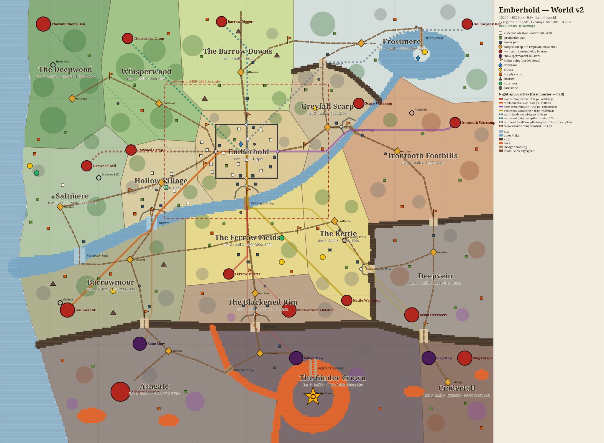

# Emberhold

**▶ Play: <https://marwanmoh11.github.io/emberhold/>** — desktop or phone, no install.

A browser game about rebuilding a burned frontier outpost: kill things, carry the
goods home on your back, raise camps, hire a crew, recruit an army, and hold the
settlement through the night.

Horde survival on top of a tycoon loop. Everything — art, sound, terrain — is
generated in code at boot. There are no asset files in this repository.

```bash
npm install
npm run dev
```

Then open <http://localhost:5180>.

## Playing

| | |
|---|---|
| Move | `WASD` / arrows, or drag the left half of the screen |
| Attack | automatic — you swing at whatever is in range |
| Dodge | `X`, or the dodge button above the ability bar |
| Build / upgrade | walk into a build site; hold `SHIFT` to fund an upgrade |
| Hire, recruit | stand on the camp or barracks |
| Abilities | `SPACE`, `Q`, `E`, `F`, `G`, ultimate on `R` |
| Army orders | the army button (top right) opens an orders panel: one row per company (infantry, archers, riders) with Defend, Follow and Hold. Hold plants a banner where the hero stands. `H` cycles every company's order |
| Atlas | `M`, the map button top right, or a tap on the minimap: the whole frontier as you have explored it |
| Travel | walk onto a lit waystone (every outpost has one), or pick a lit stone in the atlas |
| Pause | `ESC` or `P`, or the pause button top right |
| Debug panel | `F2` |

A standard controller also works: left stick or D-pad moves, A/B/X/Y/LB use
the five abilities, RB dodges, RT fires the ultimate, Start pauses, Back toggles
the map, and left stick click cycles every company's order, as `H` does. Use the D-pad and A to
navigate the pause menu; A/B/X choose level-up cards.

On a phone it plays in either orientation: drag the left half of the screen to
move, tap the buttons bottom-right for abilities and dodge, use the three icon
buttons top right for the army's orders, the atlas and pause, and
everything else happens by walking into it. A phone held upright has no corner
to spare for the minimap, so it stays away there; the map button opens the atlas.

The HUD is kept to the corners and kept quiet: vitals top left, the day and the
current objective top centre, the icon buttons and your stores top right, and
the abilities under the right thumb, all on the same dark smoked glass with no
ornament, so the world stays the brightest thing on screen. Add it to your home screen and it opens without
browser chrome. The horde is capped lower on a phone so the frame rate holds.

The loop: by day you grow a country that pays you. Kill things and carry the
wood and stone they drop to the depot or a build site, raise camps whose crews
work on their own, and the hall banks a tithe from everyone who works or lives
in the settlement. Spend it on crews, soldiers, towers and walls. By night the
horde comes for the hold, and the hold (its towers and walls, the army at its
posts, and you) is where the fight is. Survive it, then claim the next territory.

The campaign runs five acts and 53 quests across the frontier. Burning Ashgate
Fortress puts out the fire on the Regent's Causeway; cross it to the island and
the Cinder Regent rises, her ground warnings marking the fire attacks before
they land. The final fight's remaining health is saved, and endless nights
continue after the campaign victory.

## The frontier



A 10240×9216 map of 17 regions. Rivers and cliffs open only at named crossings
(bridges, fords, stairs and gates), the horde marches on the hold along
approaches from its warcamps, and each night the fronts that come are named
at dusk. Claim a region at its border stone once the hall is tall enough;
burn its camps; raise outposts, whose waystones you can travel between; fish,
trade and settle villages; and find about 60 points of interest: caches, lore,
shrines, barrows with relics, survivors. The map above is drawn from
[`src/config/world/blueprint.ts`](src/config/world/blueprint.ts) by
`npm run world:map`; how it was built is in [docs/world/](docs/world/README.md).

Two rules do most of the work:

- **Goods are physical.** Kills drop loot. Wood, food, stone, metal and crystal
  are carried on your back up to your pack limit and only count once you
  deliver them. Coins and xp are the exception: they fly to you from anywhere
  on screen, and a kill further off banks its coins and half its xp.
- **Standing somewhere is the interaction.** There is no build menu. Stand in a
  site and it draws what it needs out of your pack; stand in a camp and it hires.

At night the fronts named at dusk converge on the hold and arrive one after
another, about ten seconds apart, so you can meet one and then the next. A
front's walkers keep to the road in and fight only what is in their way; once
they reach the hold they assault it. Raids are different: they go for the
countryside and its farms, and burning a raid's camp is how you stop them. On
Defend, the army's order by default, each company stands at a post in the hold
by day and sends a detachment to a raided holding; from the warning to dawn it
deploys to tonight's front posts, where each road enters the hold. Chevrons on
the screen edge point at walkers you cannot see and at raided holdings, and at
dawn a small card sums the night up: kills, coins, what was swept, what was
sacked.

Progress saves to `localStorage` every 10 seconds, when you pause, and when the
page is hidden. The previous valid save is kept as a fallback. Use **EXPORT FILE**
in the pause menu to download a portable JSON save, then **RESTORE FILE** on the
title screen to bring it back in another browser or device. Restoring checks the
file and asks for a second press before replacing the current settlement. An interrupted
night restarts from its warning after loading, so it cannot be skipped. A Hall
loss instead gives a full day to rebuild before that same wave returns. The
pause menu has a reset button; starting a new game also asks for a second press.
Troops and workers keep their positions, injuries and carried goods; damaged
enemy camps and the Cinder Regent keep their remaining health. A saved
settlement loss reopens its recovery screen. Explored ground stays visible in
both the world and minimap, and the daytime countdown survives a reload. After
the campaign, repeatable mastery choices
keep level-ups meaningful through endless nights.

When the hero falls, a countdown shows the three-second return to the Hall.
The returning hero has a brief shield to escape enemies gathered at the spawn.

## Automation

The settlement is meant to keep earning while you are busy elsewhere, so the
resource counters never stall:

- **The hall levies a tithe.** Every second it banks coins from everyone who
  works or lives in the settlement: a levy for the hall's level, plus a little
  per crew member and per head of cottage and longhouse population. The coin
  count in the HUD shows the rate. Markets sell food and wood above 150 in store.
- **Stores are uncapped.** A shared cap meant a flood of food could freeze the
  wood counter while lumberjacks kept chopping.
- **Crews shelter instead of stopping.** When the horde is on a camp the workers
  duck inside — untargetable, and still producing at 45%.
- **Lost crew is replaced automatically.** A Warehouse additionally automates
  hiring into brand-new slots.
- **Holdings are sacked, not razed.** A farm, cottage or any other building
  that is not a wall, gate, tower or the hall keeps its level when it falls.
  It smokes, its crew shelters, and it produces, pays and trains nothing until
  it mends, which it does by itself after 25 seconds of daylight with no walker
  near; stand in it and it is whole at once, and builders speed it. No bill.
- **Defences still fall.** A wall, gate or tower at 0 hp loses a level, and at
  level 0 it leaves rubble. Rebuilding costs 40% of the original.
- **The dawn sweep.** When the night ends, every piece of cargo lying on claimed
  ground goes into stores, and walkers that flee at dawn leave their loot to it.
  Cargo on claimed ground does not rot during the night.
- **Time away pays.** Offline income, the tithe included, tapers toward a
  one-hour ceiling, so a week away and a night away are worth about the same.

One deliberate exception: **upgrading an existing building never spends on its
own.** Walk into an empty site and it builds itself out of your stores, but
raising a level costs a press of UPGRADE. Standing still used to quietly drain
every coin you owned into whatever you happened to be next to.

## Architecture

```
src/
  config/     all balance and content data — nothing here is code you run
  core/       Grid (spatial hash), Pool, events, math, ids
  entities/   plain data objects: Player, Enemy, Worker, Soldier, Building
  systems/    one manager per concern, each with update(dt)
  art/        the ink toolkit and every painted texture, baked once at boot
  world/      the terrain bake
  ui/         HUD, panels, overlays
  scenes/     Boot (bakes art, title), Game (world), UI (fixed HUD)
  dev/        scripted-play harness, dev builds only
```

Balance lives in `src/config/`. No gameplay file hard-codes a tuning number:
`balance.ts` holds the global constants, and the rest of `config/` describes
buildings, units, enemies, waves, quests, upgrades, abilities and the map.

### Performance notes

The target is a few hundred enemies at 60 fps, and the design follows from that.

- **No physics engine.** Enemies are plain objects with one `Image` each, moved
  by hand. Arcade Physics bodies for hundreds of units cost more than the AI does.
- **Spatial hashes by entity type.** `core/Grid.ts` backs the enemy, ally and
  structure queries for targeting, separation, splash and tower range.
- **Staggered AI.** Retarget timers are offset per entity id, and separation
  looks at a fixed handful of neighbours rather than all of them.
- **Pools** for enemies, projectiles, pickups and floating text.
- **The minimap redraws selectively.** Territory, structures and fog bake into a
  RenderTexture at most four times a second and only when something changed;
  the hero, camera box and enemy density are rebuilt at 9 Hz out of flat
  rectangles. Rounded rectangles and circles are paths Phaser re-triangulates
  every frame, and four of them cost more than the rest of the widget together.
- **The terrain is one draw call** — painted into a half-resolution canvas
  texture at startup. Fog of war is a quarter-resolution texture that gets erased.
- **Light is one multiply pass.** Each frame a quarter-resolution lightmap is
  filled with the hour's ambient colour, every hearth, brazier, fire and ember
  is added into it as a soft brush on a 2D canvas, and the result is multiplied
  over the world. By day it is only a warm grade.
- **The interface is painted, not drawn.** Every panel, button, bar and disc is
  painted once into a canvas texture by `src/ui/skin.ts`, cached by how it
  looks and shared: a dozen buttons of one size are one texture, and hovering
  one swaps textures rather than repainting. A health bar changing every frame
  is a crop rectangle over a fill painted at full width.
- **It renders at the screen's own resolution**, capped at 2x on a desktop and
  1.5x on a phone or weaker machine (`DPR` in `core/device.ts`). The canvas is
  sized in device pixels and each camera maps CSS pixels onto it, so layout,
  touch targets and the HUD's numbers are all still in CSS pixels. The
  lightmap stays at a quarter of the CSS resolution, so night costs no more.

The F2 panel reports rolling 95th-percentile simulation and frame times. In
the in-app preview, roughly 250 active enemies took **2.6 ms** for the game
update, while both an idle scene and the horde ran near **33 ms per frame**.
That preview appears to be capped near 30 fps; use a release build on target
hardware to establish the actual rendering limit.

## Deployment

`.github/workflows/deploy.yml` builds on every push to `main` and publishes
`dist/` to GitHub Pages. Pages serves a project site from `/emberhold/`, which
is why `vite.config.ts` sets `base` for production builds only.

## Development

```bash
npm run typecheck   # tsc --noEmit, strict
npm test            # recovery, wave retry and combat regression tests
npm run build       # typecheck, then a production bundle
npm run preview     # serve the built bundle
```

In a dev build, `window.H` is a scripted-play harness that pumps the game loop
off a synthetic clock, so a whole day/night cycle runs in a fraction of a second:

```js
H.start()            // skip the title
H.build('lumber1')   // walk there and fund it
H.pump(120)          // 120 game-seconds, as fast as the CPU allows
H.snap('two nights') // resources, crew, wave, buildings
```

## Originality

Every picture is painted by the code in `src/art/` at boot — gouache-style
fills, clipped shading and an ink line traced around every silhouette, through
the Canvas2D toolkit in `src/art/ink.ts` — and every sound is synthesised
through WebAudio oscillators and noise buffers. The name, world, buildings,
units and progression are original to this project.

The two typefaces are the exception: Grenze Gotisch and Alegreya Sans, both
under the SIL Open Font License, installed from npm (`@fontsource`) and bundled
with the build, so nothing is fetched from a font service at runtime.
